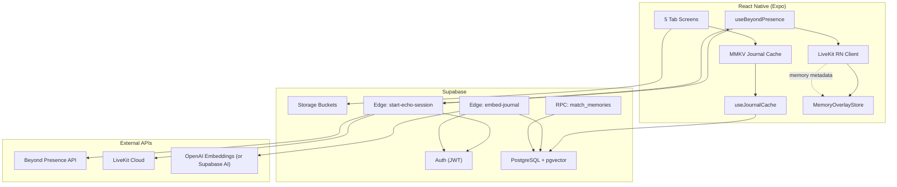
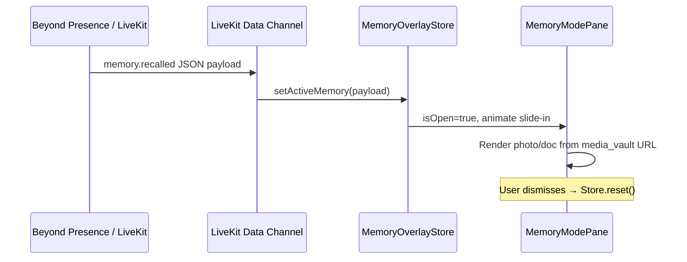

# Echoes (Presence) — 24-Hour Hackathon Architectural Blueprint

> **Stack:** Expo 54 (Managed) · Expo Router v6 · NativeWind · Supabase · Beyond Presence · LiveKit RN SDK · MMKV offline cache  
> **Docs baseline:** [Expo SDK 54](https://docs.expo.dev/versions/v54.0.0/)

---

## 1. Executive Summary

Echoes is an AI memory avatar platform. Users capture legacy journals locally, sync to Supabase, vectorize memories for RAG, and converse with a hyper-realistic avatar via Beyond Presence + LiveKit WebRTC. A secure Supabase Edge Function bridge keeps API keys off-device.

**North-star flows:**

| Flow | Path |
|------|------|
| Journal ingest | Local MMKV → async `journals` upsert → Edge `embed-journal` → `journal_embeddings` |
| Avatar session | `useBeyondPresence` → Edge `start-echo-session` → LiveKit room creds → full-screen `presence` tab |
| Memory recall UI | LiveKit data channel / BP metadata → `MemoryOverlayStore` → slide-in pane on `presence` |

---

## 2. System Architecture



### 2.1 Data Flow (Detailed)

#### A. Ingestion & Local Cache

1. User submits text on **Journal** screen.
2. `useJournalCache.addEntry()` writes to MMKV immediately (`pending_sync: true`).
3. UI list re-renders from MMKV (zero latency).
4. Background `JournalSyncService` batches pending rows → `supabase.from('journals').upsert()`.
5. On success: flip `pending_sync: false` in MMKV; store remote `id`.
6. Database trigger or client calls Edge `embed-journal` with `journal_id`.

#### B. Secure Bridge (Avatar Session)

1. User taps **Begin Echo Session** on Home → navigates to `presence` tab (or auto-starts).
2. `useBeyondPresence.startSession()`:
   - Reads Supabase session JWT.
   - `POST /functions/v1/start-echo-session` with `{ persona_id?, context_limit? }`.
3. Edge Function (service role + user JWT verify):
   - Loads `profiles` persona + recent memory snippets via `match_memories` RPC.
   - Calls Beyond Presence API to create agent + LiveKit room.
   - Returns `{ roomName, token, wsUrl, sessionId, agentId }`.
4. Hook connects LiveKit with `@livekit/react-native`.
5. On `disconnect`, Edge optional `end-echo-session` cleanup.

#### C. Memory RAG Engine

1. **Embed path:** `embed-journal` receives `journal_id`, fetches row, chunks if >512 tokens, calls embedding API, inserts `journal_embeddings`.
2. **Query path (live):** Beyond Presence backend (or Edge proxy) calls `match_memories(query_embedding, user_id, limit)` during session.
3. **Client overlay path:** When BP/LiveKit emits `memory.recalled` event with `{ memory_id, media_id?, title, snippet, year }`, `MemoryOverlayStore` opens slide-in pane.

---

## 3. Complete File Tree

```
echo/
├── app/
│   ├── _layout.tsx                    # Root Stack, providers (Auth, Query, Theme)
│   ├── modal.tsx                      # Optional: full-screen memory detail
│   └── (tabs)/
│       ├── _layout.tsx                # 5-tab bar, dark cinematic styling
│       ├── index.tsx                  # Home — greeting, stats, Begin Session CTA
│       ├── journal.tsx                # Journal feed + FAB + search
│       ├── presence.tsx               # HERO — LiveKit video, PTT, captions, Memory Mode
│       ├── timeline.tsx               # Year-grouped media vault
│       └── settings.tsx               # Persona sliders, profile, connection checklist
│
├── components/
│   ├── ui/                            # Buttons, sliders, inputs (NativeWind)
│   ├── home/
│   │   ├── GreetingPanel.tsx
│   │   ├── StatsRow.tsx
│   │   └── BeginSessionButton.tsx
│   ├── journal/
│   │   ├── JournalList.tsx
│   │   ├── JournalEntryCard.tsx
│   │   ├── JournalComposer.tsx      # Modal / bottom sheet for new entry
│   │   └── JournalSearchBar.tsx
│   ├── presence/
│   │   ├── VideoViewport.tsx          # LiveKit VideoTrack wrapper
│   │   ├── HoldToTalkButton.tsx
│   │   ├── TranscriptCaptions.tsx
│   │   ├── MemoryModePane.tsx         # Slide-in from right
│   │   └── MemoryRecallCard.tsx       # Document/photo overlay content
│   ├── timeline/
│   │   ├── YearSection.tsx
│   │   ├── TimelineItem.tsx
│   │   └── MediaUploadPicker.tsx
│   └── settings/
│       ├── PersonaSliderGroup.tsx
│       ├── ProfileForm.tsx
│       └── ConnectionChecklist.tsx
│
├── hooks/
│   ├── useBeyondPresence.ts           # Session lifecycle, LiveKit connect/disconnect
│   ├── useJournalCache.ts             # MMKV read/write, optimistic list
│   ├── useJournalSync.ts              # Background Supabase sync queue
│   ├── useMemoryOverlay.ts            # Subscribes to recall events → pane state
│   ├── usePersona.ts                  # CRUD profiles.persona_traits
│   └── useTimeline.ts                 # media_vault queries + upload
│
├── lib/
│   ├── supabase.ts                    # Typed Supabase client (anon key only)
│   ├── mmkv.ts                        # Storage instance + keys enum
│   ├── journal-sync.ts                # Queue processor
│   ├── livekit.ts                     # Room helpers, track subscription
│   └── types/
│       ├── database.ts                # Generated Supabase types
│       ├── beyond-presence.ts         # Session response shapes
│       └── memory-events.ts           # Memory recall payload types
│
├── stores/
│   ├── memory-overlay.store.ts        # Zustand: pane open, active memory payload
│   └── session.store.ts             # Zustand: connection state, transcripts
│
├── constants/
│   ├── theme.ts                       # Extend for cinematic dark palette
│   └── persona.ts                     # Trait definitions (humor, warmth, wisdom)
│
├── providers/
│   ├── AuthProvider.tsx
│   └── SupabaseProvider.tsx
│
├── supabase/
│   ├── config.toml
│   ├── migrations/
│   │   ├── 001_extensions.sql
│   │   ├── 002_core_tables.sql
│   │   ├── 003_rls_policies.sql
│   │   ├── 004_vector_rpc.sql
│   │   └── 005_storage_buckets.sql
│   └── functions/
│       ├── start-echo-session/
│       │   └── index.ts
│       ├── embed-journal/
│       │   └── index.ts
│       └── _shared/
│           ├── cors.ts
│           ├── supabase-admin.ts
│           └── beyond-presence-client.ts
│
├── assets/
├── app.json                           # Plugins: expo-router, livekit, mmkv, nativewind
├── tailwind.config.js
├── global.css
├── PLAN.md                            # This file
└── package.json
```

### 3.1 Tab Router Mapping

| Route | File | Tab label | Icon |
|-------|------|-----------|------|
| `/` | `(tabs)/index.tsx` | Home | `house.fill` |
| `/journal` | `(tabs)/journal.tsx` | Journal | `book.fill` |
| `/presence` | `(tabs)/presence.tsx` | Presence | `video.fill` |
| `/timeline` | `(tabs)/timeline.tsx` | Timeline | `clock.fill` |
| `/settings` | `(tabs)/settings.tsx` | Settings | `gearshape.fill` |

Remove scaffold `explore.tsx` after Sprint 1.

---

## 4. Database Schema Blueprint

### 4.1 Extensions & Enums

```sql
-- supabase/migrations/001_extensions.sql
CREATE EXTENSION IF NOT EXISTS "uuid-ossp";
CREATE EXTENSION IF NOT EXISTS vector;

CREATE TYPE sync_status AS ENUM ('pending', 'synced', 'failed');
CREATE TYPE media_type AS ENUM ('photo', 'letter', 'voice', 'video', 'document');
```

### 4.2 Core Tables (DDL)

```sql
-- supabase/migrations/002_core_tables.sql

-- Extends auth.users (1:1)
CREATE TABLE public.profiles (
  id              UUID PRIMARY KEY REFERENCES auth.users(id) ON DELETE CASCADE,
  display_name    TEXT,
  avatar_url      TEXT,
  persona_traits  JSONB NOT NULL DEFAULT '{
    "humor": 50,
    "warmth": 70,
    "wisdom": 60,
    "verbosity": 40,
    "formality": 30
  }'::jsonb,
  bp_agent_id     TEXT,                    -- Beyond Presence agent reference
  last_synced_at  TIMESTAMPTZ,
  created_at      TIMESTAMPTZ NOT NULL DEFAULT now(),
  updated_at      TIMESTAMPTZ NOT NULL DEFAULT now()
);

-- Textual memory / journal entries
CREATE TABLE public.journals (
  id              UUID PRIMARY KEY DEFAULT uuid_generate_v4(),
  user_id         UUID NOT NULL REFERENCES public.profiles(id) ON DELETE CASCADE,
  title           TEXT,
  body            TEXT NOT NULL,
  mood_tag        TEXT,
  keywords        TEXT[] DEFAULT '{}',
  memory_year     INT,                     -- Optional anchor year for timeline cross-link
  is_embedded     BOOLEAN NOT NULL DEFAULT false,
  local_id        TEXT UNIQUE,             -- Client MMKV id for idempotent sync
  sync_status     sync_status NOT NULL DEFAULT 'pending',
  created_at      TIMESTAMPTZ NOT NULL DEFAULT now(),
  updated_at      TIMESTAMPTZ NOT NULL DEFAULT now()
);

CREATE INDEX idx_journals_user_created ON public.journals(user_id, created_at DESC);
CREATE INDEX idx_journals_local_id ON public.journals(local_id);
CREATE INDEX idx_journals_keywords ON public.journals USING GIN(keywords);

-- Vector store for RAG (chunked embeddings)
CREATE TABLE public.journal_embeddings (
  id              UUID PRIMARY KEY DEFAULT uuid_generate_v4(),
  journal_id      UUID NOT NULL REFERENCES public.journals(id) ON DELETE CASCADE,
  user_id         UUID NOT NULL REFERENCES public.profiles(id) ON DELETE CASCADE,
  chunk_index     INT NOT NULL DEFAULT 0,
  chunk_text      TEXT NOT NULL,
  embedding       vector(1536) NOT NULL,   -- OpenAI text-embedding-3-small dimension
  created_at      TIMESTAMPTZ NOT NULL DEFAULT now(),
  UNIQUE(journal_id, chunk_index)
);

CREATE INDEX idx_journal_embeddings_vector
  ON public.journal_embeddings
  USING hnsw (embedding vector_cosine_ops);

-- Multimedia vault (timeline)
CREATE TABLE public.media_vault (
  id              UUID PRIMARY KEY DEFAULT uuid_generate_v4(),
  user_id         UUID NOT NULL REFERENCES public.profiles(id) ON DELETE CASCADE,
  journal_id      UUID REFERENCES public.journals(id) ON DELETE SET NULL,
  media_type      media_type NOT NULL,
  storage_path    TEXT NOT NULL,           -- Supabase Storage object path
  public_url      TEXT,                    -- Signed or public URL cache
  title           TEXT,
  description     TEXT,
  memory_year     INT NOT NULL,            -- Timeline grouping key (e.g. 1974, 1985)
  keywords        TEXT[] DEFAULT '{}',
  metadata        JSONB DEFAULT '{}',      -- EXIF, duration, mime, etc.
  created_at      TIMESTAMPTZ NOT NULL DEFAULT now(),
  updated_at      TIMESTAMPTZ NOT NULL DEFAULT now()
);

CREATE INDEX idx_media_vault_user_year ON public.media_vault(user_id, memory_year DESC);
CREATE INDEX idx_media_vault_keywords ON public.media_vault USING GIN(keywords);

-- Live session audit log (optional but useful for hackathon demo)
CREATE TABLE public.echo_sessions (
  id              UUID PRIMARY KEY DEFAULT uuid_generate_v4(),
  user_id         UUID NOT NULL REFERENCES public.profiles(id) ON DELETE CASCADE,
  livekit_room    TEXT NOT NULL,
  bp_session_id   TEXT,
  started_at      TIMESTAMPTZ NOT NULL DEFAULT now(),
  ended_at        TIMESTAMPTZ,
  memories_recalled INT DEFAULT 0
);
```

### 4.3 Relationship Model

```
auth.users 1──1 profiles
profiles   1──* journals
journals   1──* journal_embeddings
profiles   1──* media_vault
journals   0──1 media_vault (optional link)
media_vault.memory_year ──► timeline UI grouping
journals.memory_year    ──► cross-reference for Memory Mode overlay
```

### 4.4 RLS Policies (Summary)

```sql
-- supabase/migrations/003_rls_policies.sql
ALTER TABLE profiles ENABLE ROW LEVEL SECURITY;
ALTER TABLE journals ENABLE ROW LEVEL SECURITY;
ALTER TABLE journal_embeddings ENABLE ROW LEVEL SECURITY;
ALTER TABLE media_vault ENABLE ROW LEVEL SECURITY;
ALTER TABLE echo_sessions ENABLE ROW LEVEL SECURITY;

-- profiles: users read/update own row only
CREATE POLICY "profiles_select_own" ON profiles FOR SELECT USING (auth.uid() = id);
CREATE POLICY "profiles_update_own" ON profiles FOR UPDATE USING (auth.uid() = id);

-- journals, media_vault, echo_sessions: CRUD own rows
CREATE POLICY "journals_all_own" ON journals FOR ALL USING (auth.uid() = user_id);
CREATE POLICY "media_all_own" ON media_vault FOR ALL USING (auth.uid() = user_id);
CREATE POLICY "sessions_all_own" ON echo_sessions FOR ALL USING (auth.uid() = user_id);

-- embeddings: read own; inserts via service role (Edge Function) only
CREATE POLICY "embeddings_select_own" ON journal_embeddings
  FOR SELECT USING (auth.uid() = user_id);
```

### 4.5 Vector Search RPC

```sql
-- supabase/migrations/004_vector_rpc.sql
CREATE OR REPLACE FUNCTION match_memories(
  query_embedding vector(1536),
  match_user_id   UUID,
  match_count     INT DEFAULT 5,
  match_threshold FLOAT DEFAULT 0.75
)
RETURNS TABLE (
  journal_id    UUID,
  chunk_text    TEXT,
  similarity    FLOAT,
  memory_year   INT,
  keywords      TEXT[]
)
LANGUAGE sql STABLE
AS $$
  SELECT
    je.journal_id,
    je.chunk_text,
    1 - (je.embedding <=> query_embedding) AS similarity,
    j.memory_year,
    j.keywords
  FROM journal_embeddings je
  JOIN journals j ON j.id = je.journal_id
  WHERE je.user_id = match_user_id
    AND 1 - (je.embedding <=> query_embedding) > match_threshold
  ORDER BY je.embedding <=> query_embedding
  LIMIT match_count;
$$;
```

### 4.6 Storage Buckets

```sql
-- supabase/migrations/005_storage_buckets.sql
INSERT INTO storage.buckets (id, name, public)
VALUES ('media-vault', 'media-vault', false);

-- RLS: authenticated users upload/read own folder: {user_id}/*
```

---

## 5. Edge Functions Specification

### 5.1 `start-echo-session`

| Item | Detail |
|------|--------|
| **Method** | `POST` |
| **Auth** | Bearer JWT (verify via Supabase Auth) |
| **Secrets** | `BEYOND_PRESENCE_API_KEY`, `LIVEKIT_API_KEY`, `LIVEKIT_API_SECRET`, `LIVEKIT_URL` |
| **Input** | `{ persona_overrides?: Partial<PersonaTraits> }` |
| **Steps** | 1) Validate user 2) Load profile + top-K memories 3) BP create session 4) Mint LiveKit token 5) Insert `echo_sessions` row |
| **Output** | `{ token, wsUrl, roomName, sessionId }` |

### 5.2 `embed-journal`

| Item | Detail |
|------|--------|
| **Method** | `POST` |
| **Auth** | Service role or user JWT |
| **Secrets** | `OPENAI_API_KEY` (or `SUPABASE_AI` endpoint) |
| **Input** | `{ journal_id: string }` |
| **Steps** | 1) Fetch journal 2) Chunk body 3) Embed each chunk 4) Upsert `journal_embeddings` 5) Set `journals.is_embedded = true` |
| **Output** | `{ chunks_embedded: number }` |

---

## 6. Screen Blueprints

### 6.1 Home — `(tabs)/index.tsx`

**Purpose:** Emotional entry point and session launcher.

| Element | Implementation |
|---------|----------------|
| Greeting | Time-of-day + `profiles.display_name` |
| Stats row | `COUNT(journals)`, `COUNT(media_vault)`, last `echo_sessions.started_at` |
| Avatar sync status | Badge: `bp_agent_id` present + last sync timestamp |
| Primary CTA | `Begin Echo Session` → `router.push('/presence')` + `useBeyondPresence.startSession()` |

**Layout:** Dark gradient background, centered serif greeting, pill CTA with haptic feedback.

---

### 6.2 Journal — `(tabs)/journal.tsx`

**Purpose:** Offline-first legacy text capture.

| Element | Implementation |
|---------|----------------|
| Feed | `FlatList` from `useJournalCache.entries` (MMKV-first) |
| FAB | Opens `JournalComposer` modal |
| Search | Client filter on title/body/keywords; optional server full-text later |
| Sync indicator | Dot on cards where `pending_sync === true` |

**Hook contract (`useJournalCache`):**

```ts
interface JournalCacheEntry {
  localId: string;
  title?: string;
  body: string;
  keywords?: string[];
  memoryYear?: number;
  pendingSync: boolean;
  remoteId?: string;
  createdAt: string;
}
```

---

### 6.3 Presence (HERO) — `(tabs)/presence.tsx`

**Purpose:** Immersive LiveKit avatar communication.

| Element | Implementation |
|---------|----------------|
| Video viewport | `VideoViewport` — `Room` + remote participant video track, `object-fit: cover`, full screen |
| Hold-to-talk | `Pressable` `onPressIn` → enable mic track; `onPressOut` → disable (or BP push-to-talk API) |
| Captions | `TranscriptCaptions` — subscribes to LiveKit transcription / BP text events |
| Memory Mode pane | `MemoryModePane` — `Animated` slide from right, 40% width overlay |

#### Memory Overlay Event Bridge



**Payload shape (`memory-events.ts`):**

```ts
type MemoryRecalledEvent = {
  type: 'memory.recalled';
  journalId?: string;
  mediaId?: string;
  title: string;
  snippet: string;
  memoryYear?: number;
  thumbnailUrl?: string;
};
```

**`useBeyondPresence` responsibilities:**

- `startSession()` / `endSession()`
- Hold `Room` ref; expose `connectionState`
- Register `RoomEvent.DataReceived` → parse `MemoryRecalledEvent` → `useMemoryOverlay.open()`
- Fetch media URL from Supabase if only `mediaId` provided

---

### 6.4 Timeline — `(tabs)/timeline.tsx`

**Purpose:** Chronological multimedia archive.

| Element | Implementation |
|---------|----------------|
| Year sections | `SectionList` grouped by `media_vault.memory_year` DESC |
| Items | Thumbnail (photo), icon (letter/voice), title, keywords chips |
| Upload | `expo-image-picker` / `expo-document-picker` → `supabase.storage.from('media-vault').upload()` → insert row |
| Tags | `memory_year` (required), `keywords[]`, optional `journal_id` link |

---

### 6.5 Settings — `(tabs)/settings.tsx`

**Purpose:** Persona tuning and account health.

| Element | Implementation |
|---------|----------------|
| Persona sliders | humor, warmth, wisdom, verbosity, formality (0–100) |
| Sync | Debounced `profiles.persona_traits` update |
| Profile | `display_name`, `avatar_url` (image picker → Storage) |
| Connection checklist | Supabase ✓, Beyond Presence ✓ (last session), LiveKit ✓, Embeddings count |

---

## 7. Key Hooks & Stores

### 7.1 `useBeyondPresence.ts`

```ts
// Pseudocode contract
export function useBeyondPresence() {
  return {
    connectionState: 'idle' | 'connecting' | 'connected' | 'error',
    room: Room | null,
    startSession: () => Promise<void>,
    endSession: () => Promise<void>,
    setMicrophoneEnabled: (enabled: boolean) => void,
    transcripts: string[],
  };
}
```

### 7.2 `memory-overlay.store.ts` (Zustand)

```ts
interface MemoryOverlayState {
  isOpen: boolean;
  activeMemory: MemoryRecalledEvent | null;
  open: (memory: MemoryRecalledEvent) => void;
  close: () => void;
}
```

---

## 8. Dependencies to Add (Sprint 1)

```bash
npx expo install nativewind tailwindcss react-native-mmkv
npx expo install @supabase/supabase-js @react-native-async-storage/async-storage
npx expo install @livekit/react-native @livekit/react-native-webrtc livekit-client
npx expo install zustand expo-image-picker expo-document-picker expo-secure-store
npm install -D tailwindcss prettier-plugin-tailwindcss
```

Configure `app.json` plugins per LiveKit Expo docs (SDK 54). Enable `userInterfaceStyle: "dark"` for cinematic default.

---

## 9. Environment Variables

| Location | Variable |
|----------|----------|
| Expo (public) | `EXPO_PUBLIC_SUPABASE_URL`, `EXPO_PUBLIC_SUPABASE_ANON_KEY` |
| Edge Functions | `SUPABASE_URL`, `SUPABASE_SERVICE_ROLE_KEY`, `BEYOND_PRESENCE_API_KEY`, `LIVEKIT_API_KEY`, `LIVEKIT_API_SECRET`, `LIVEKIT_URL`, `OPENAI_API_KEY` |

Never ship BP or LiveKit secrets in the mobile bundle.

---

## 10. 24-Hour Implementation Roadmap

### Hour 0–2 — Sprint 0: Scaffold & Design System

- [ ] Rename/remove `explore.tsx`; create 5 tab files
- [ ] Install NativeWind + dark cinematic theme tokens
- [ ] Add `lib/supabase.ts`, `providers/AuthProvider.tsx`
- [ ] Stub all 5 screens with placeholder layout

**Exit criteria:** App runs with 5 tabs, dark theme, navigation works.

---

### Hour 2–6 — Sprint 1: Supabase & Edge Functions

- [ ] Create Supabase project; run migrations `001`–`005`
- [ ] Enable Auth (email magic link or anonymous for hackathon speed)
- [ ] Implement RLS policies
- [ ] Deploy `start-echo-session` + `embed-journal` Edge Functions
- [ ] Store secrets in Supabase dashboard
- [ ] Test Edge Functions via `curl` / Supabase CLI

**Exit criteria:** User can sign in; journal row inserts; Edge returns mock/real LiveKit token.

---

### Hour 6–10 — Sprint 2: Local Caching & Journal Sync

- [ ] `lib/mmkv.ts` + `useJournalCache` + `useJournalSync`
- [ ] Journal screen: FAB composer, list, pending sync badges
- [ ] Background sync on app foreground + network reconnect
- [ ] Wire `embed-journal` on successful sync

**Exit criteria:** Airplane mode write → reconnect → Supabase row + embedding exists.

---

### Hour 10–14 — Sprint 3: Core WebRTC Player & Presence Layout

- [ ] Implement `useBeyondPresence` (token fetch + LiveKit connect)
- [ ] `VideoViewport` full-screen on `presence.tsx`
- [ ] Hold-to-talk mic toggle
- [ ] Connection states + error UI
- [ ] Home CTA starts session and navigates to Presence

**Exit criteria:** Avatar video visible; mic hold-to-talk works; disconnect clean.

---

### Hour 14–18 — Sprint 4: Memory RAG & Overlay Sync

- [ ] Verify `match_memories` RPC with test embedding
- [ ] Pass memory context in `start-echo-session` BP payload
- [ ] Implement `MemoryOverlayStore` + `MemoryModePane`
- [ ] Parse LiveKit data / BP metadata → open overlay
- [ ] Link overlay to `media_vault` / `journals` fetch by ID

**Exit criteria:** Simulated or real `memory.recalled` event slides pane with correct content.

---

### Hour 18–21 — Sprint 5: Timeline & Settings

- [ ] Timeline `SectionList` by year
- [ ] Storage upload flow + `media_vault` insert
- [ ] Settings persona sliders → `profiles.persona_traits`
- [ ] Connection checklist (ping Edge, count embeddings)

**Exit criteria:** Photo upload appears in correct year bucket; persona persists.

---

### Hour 21–24 — Sprint 6: Polish, Demo & Hardening

- [ ] Home stats query optimization
- [ ] Transcript captions styling
- [ ] Error boundaries + retry on session start
- [ ] Demo script + seed data (3 journals, 2 media items, 2 years)
- [ ] EAS build smoke test (optional)
- [ ] README demo steps

**Exit criteria:** End-to-end demo in <3 minutes without crashes.

---

## 11. Risk Register & Mitigations

| Risk | Mitigation |
|------|------------|
| LiveKit + Expo native module build pain | Test dev client by Hour 10; use EAS prebuild early |
| BP API latency on cold start | Show connecting UI; cache last `bp_agent_id` on profile |
| Embedding cost/time | Embed async post-sync; cap chunk count at 5 per journal |
| MMKV web unsupported | Platform check; fallback `expo-secure-store` on web |
| Memory event schema drift | Version field in `MemoryRecalledEvent.type` |

---

## 12. Demo Script (3 Minutes)

1. Open app → Home shows name + “12 memories saved”.
2. Journal → add “Grandma's kitchen, 1974” → instant list appearance.
3. Timeline → upload vintage photo tagged `1974`.
4. Settings → bump warmth slider to 90.
5. Home → **Begin Echo Session** → Presence full-screen avatar.
6. Ask about 1974 → Memory pane slides in with photo + journal snippet.
7. End session → return Home; checklist all green.

---

## 13. Post-Hackathon Backlog

- Voice journal entries + Whisper transcription
- Push notifications for sync failures
- Multi-avatar / family sharing on `profiles`
- Offline embedding queue
- Analytics via Supabase Logs + session replay

---

*Generated for Echo hackathon — revise sprint hours if team size > 2.*
